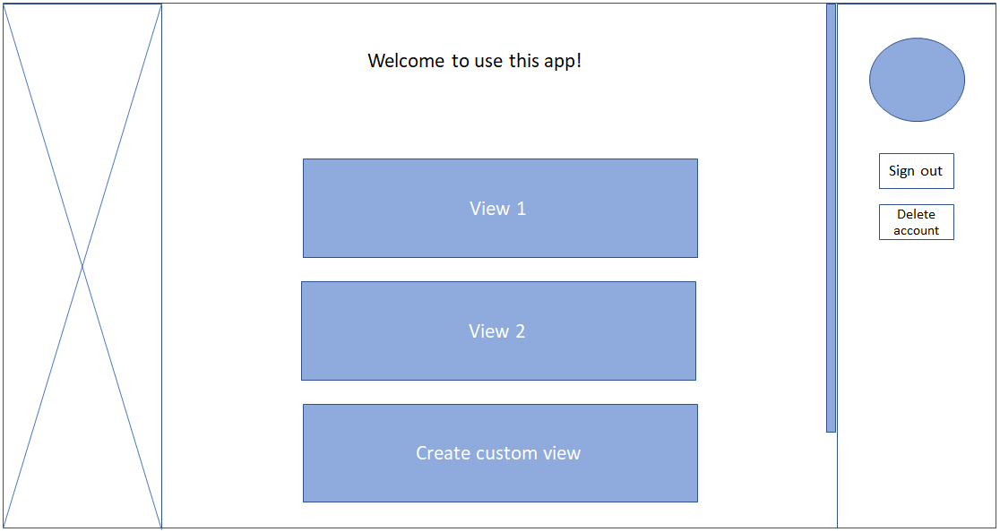
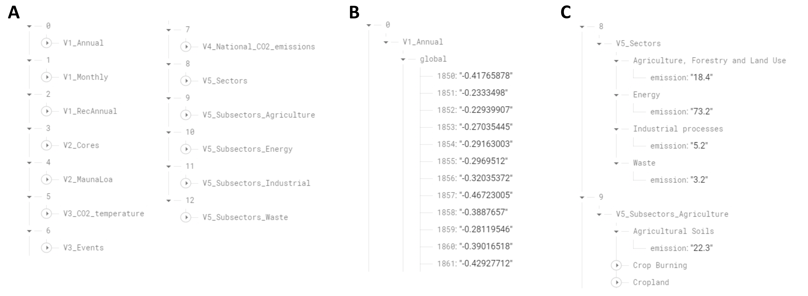

# Visual Climate -sovellusprojekti

IN00CT06-3004 Web-ohjelmoinnin sovellusprojekti, kevät 2023 - Ryhmä 12: Joose Ahonen, Jussi Mäki, Essi Nissinen ja Justiina Ronkainen

## Taustaa

Tämä työ on osa Oulun ammattikorkeakoulun kevään 2023 Web-ohjelmoinnin sovellusprojektia. Tavoitteena on tehdä ilmastonmuutoksen historiallisia muutoksia visualisoiva responsiivinen web-ohjelma nimeltään Visual Climate. Ohjelmaan kirjaudutaan sisään sähköpostilla, minkä jälkeen käyttäjä voi valita kolmen näkymän välillä: 1) Maapallon lämpötilan ja hiilidioksidipitoisuuksien muutokset, 2) Päästölähteet ja 3) Käyttäjän luoma oma visualisointinäkymä. Käyttäjä pystyy halutessaan muokkaamaan omaa näkymäänsä, tallentamaan ja poistamaan sen sekä jakamaan sen julkisella osoitteella ilman kirjautumista.

### Näkymä 1

Ensimmäisen näkymän teemana on maapallon lämpötilan ja hiilidioksidin määrän muutokset. Näkymässä on kolme kuvaajaa, joista ensimmäisessä esitetään maailman pintalämpötilan kehitys vuodesta 1850 vuoteen 2023 (Morice ym. 2021). Käyttäjä voi valita kuvaajaan näytettäväksi koko maapallon, pohjoisen pallonpuoliskon tai eteläisen pallonpuoliskon lämpötilat sekä joko vuosittaiset tai kuukausittaiset arvot. Lisäksi käyttäjä voi halutessaan lisätä kuvaajaan pohjoisen pallonpuoliskon lämpötilan mallinnuksen viimeisten 2000 vuoden ajalta (Moberg ym. 2005).

Kuvaajassa 2 esitetään ilmakehän hiilidioksidipitoisuuden muutoksia ajan funktiona viimeisten 1 000 vuoden ajalta. Kuvaajassa valittavana olevat kuukausittaisten ja vuosittaisten hiilidioksidiarvojen mittaukset on tehty Mauna Loan observatoriossa Havaijilla (NOAA GML 2023). Näiden arvojen lisäksi käyttäjä voi valita kuvaajaan näytettäväksi mittausarvot näytteistä, jotka on kerätty Etelämantereella sijaitsevan Law Dome -jäätikön jääkerroksesta. Pitoisuusdata on esitetty ppm-yksiköissä (osaa miljoonasta) ja se ulottuu nykypäivään saakka. Kuvaajasta voidaan havaita, että hiilidioksidipitoisuudet ovat pysyneet suhteellisen vakaina viimeiset 1 000 vuotta, mutta kasvaneet nopeasti teollistumisen myötä 1800-luvun lopulta lähtien. Tämä viittaa siihen, että ihmisten toiminta on merkittävästi vaikuttanut ilmakehän hiilidioksidipitoisuuden kasvuun (CDIAC 2023).

Kuvaajassa 3 mallinnetaan maapallon lämpötilan muutokset viimeisen kahden miljoonan vuoden ajalta sekä ilmakehän hiilidioksidipitoisuudet viimeisen 800 000 vuoden ajalta (Snyder 2016). Tämän lisäksi käyttäjä voi lisätä kuvaajaan muutamia ihmisen ja maapallon kehitykseen liittyviä historiallisia tapahtumia ja tarkastella niiden mahdollisia vaikutuksia lämpötilaan ja/tai hiilidioksidipitoisuuteen (Doncaster 2023).

### Näkymä 2

Toisen näkymän kuvaajissa 4 ja 5 esitetään maailman päästölähteitä ja niiden muutoksia eri aikakausina. Kuvaajassa 4 esitetään maapallon hiilidioksidipäästöjen määrän kehitys yli 200 maan osalta vuosien 1959–2020 ajalta. Kuvaaja näyttää käyttäjän valitsemien maiden perusteella Hallitustenvälisen ilmastonmuutospaneelin (IPCC) Global Carbon Budget 2021 -raportista peräisin olevat hiilidioksidipäästöjen vuosittaiset kokonaismäärät (ICOS Carbon Portal 2021).

Kuvaaja 5 on ympyräkuvaaja, jossa esitetään maailman hiilidioksidipäästöt sektoreittain. Kuvaajassa näkyy ensin neljä pääsektoria (energia, maanviljelys ja metsänhoito, teollisuus ja jätteet), joista käyttäjä voi klikkaamalla avata pääsektorin päästöjen jakaumat alasektoreittain uuteen kuvaajaan (Ritchie & Roser. 2022).

### Käyttäjäkohtainen näkymä

Kolmannessa sovelluksen tarjoamassa näkymässä käyttäjä voi rakentaa ja tallentaa oman näkymänsä. Näkymään on valittavissa muissa näkymissä esitetyt kuvaajat ja lisäksi käyttäjä voi kirjoittaa näkymään oman kuvaustekstinsä. Kun näkymä on valmis, se voidaan tallentaa tietokantaan. Tämän jälkeen käyttäjä voi jakaa kuvaajan nähtäväksi myös muille yksilöllisen URL-osoitteen avulla. Tallennettua näkymää pääsee tarkastelemaan kirjautumatta sisälle sovellukseen. 

## Käytetyt teknologiat

### Wireframe ja Stoplight

Ennen projektin toteutuksen aloittamista web-sovelluksen käyttöliittymä suunniteltiin Wireframe-palvelussa ja ohjelmointirajapinta suunniteltiin hyödyntäen Stoplight-web-sovellusta. Käyttöliittymäsuunnitelmassa ensimmäisenä avautuva kirjautumissivu suunniteltiin rakenteeltaan erilaiseksi verrattuna päänäkymään, joka aukeaa kirjautumisen jälkeen. Päänäkymässä sivun oikeassa laidassa näkyvä sivupalkki pysyy samalla paikalla käyttäjän vaihtaessa näkymiä (Kuva 1). Päänäkymän painikkeista avautuvat osiot päivittyvät sivun main-osioon.

 
Kuva 1. Käyttöliittymäsuunnitelman kuva päänäkymästä, jossa käyttäjä on kirjautuneena sisälle sovellukseen. Oikeassa reunassa on kuvattu sivupalkki, jossa esitetään käyttäjän kuva sekä napit, joiden avulla käyttäjä voi kirjautua ulos sovelluksesta tai poistaa käyttäjätilinsä.  

### Firebase ja tietokantarakenne

Firebase on Googlen sovelluskehitykseen tarkoitettu alusta, joka tarjoaa erilaisia mobiili- ja web-sovelluksiin tarvittavia palveluja (Google 2023a). Firebase-palveluun luotiin ensin pohja tätä projektia varten, jonka jälkeen valittiin halutut palvelut. Tässä projektissa käytettiin autentikaatiopalvelua kirjautumiseen (Firebase Authentication) sekä pilvipalvelua datan tallennukseen (Cloud Firestore). Autentikaation sai käyttöön Firebase-sivuston consolessa, jossa voi valita kirjautumismenetelmäksi esimerkiksi sähköpostin, Google- tai Facebook-tunnuksen (Google 2023a). Tähän projektiin valittiin kirjautumisvaihtoehdoksi sähköposti.

Cloud Firestore on noSQL-tietokanta eli perinteisestä relaatiomallista poikkeava tietokanta. Se on suunniteltu helppoon datan tallennukseen, synkronisointiin ja hakemiseen. Firebase tarjoaa kaksi vaihtoehtoa tietokannan tallennukseen, Firestore tai Realtime Database. Firestore toimii hyvin käyttäjän syöttämien tietojen tallennukseen, joten sitä käytettiin tässä projektissa käyttäjäkohtaisten näkymien tietojen tallentamiseen. Realtime-tietokantaan on puolestaan helpompi tallentaa iso määrä dataa kerralla, joten kuvaajien piirtämiseen käytetty data tallennettiin Firebasen Realtime Databaseen (Google 2023). Realtime Databaseen voi tuoda vain yhden json-tiedoston (JavaScript Object Notation), joten kaikki data yhdistettiin ennen tallennusta yhdeksi json-objektiksi. Tietokantarakenne muodostui siten, että jokaiseen kuvaajaan käytettävä data muodosti oman sisäkkäisen json-objektin (Kuva 2A). Sisäkkäiset json-objektit nimettiin käyttämällä kuvaajan numeroa sekä kyseisten tietojen kuvausta. Esimerkiksi kuvaajassa 1 käytetyt vuosittaisten hiilidioksidipäästöjen objektit nimettiin V1_Annual (V tulee englannin kielen sanasta visualization). Yksittäisten json-objektien avain (key) vastasi yleensä vuosilukua tai vuosi-kuukausiyhdistelmää ja arvo (value) oli mittaustulos (Kuva 2B). Kuvaajan 5 datassa ei ollut vuosilukuja, joten sen rakenne oli erilainen (Kuva 2C).

Kuva 2. Kuvaajiin käytettävän datan tietokantarakenne. (A) Sisäkkäiset json-objektit on nimetty niin, että niistä näkee, mihin kuvaajaan (V1-V5) kyseinen objekti kuuluu. (B) Esimerkki yksittäisen json-objektin alusta, missä avain vastaa vuosilukua ja arvo mittaustulosta. (C) Kuvaajan 5 datarakenne poikkeaa muista, sillä siinä ei tarkasteltu vuosittaista vaihtelua vaan hiilidioksidipäästöjen osuuksia eri sektorien välillä.

### Node.js REST-rajapinta

Web-sovellukselle tehtiin REST-rajapinta, joka toteutettiin Node-palvelimella. REST (Representational State Transfer) on arkkitehtuurimalli, joka määrittelee, miten eri ohjelmistojärjestelmät voivat kommunikoida keskenään internetin yli käyttäen HTTP-protokollaa (Hypertext Transfer Protocol). Sovelluksen palvelimelle tehtiin CRUD-toiminnot (Create, Read, Update, Delete), joiden avulla mahdollistettiin tietojen vieminen, hakeminen, päivitys ja poisto Firebase-tietokannasta. CRUD-toimintojen palautusarvona saatiin tieto, onnistuiko halutun toiminallisuuden toteuttaminen tietokantaan.

### React, CSS ja Frontend

CSS (Cascading Style Sheets) on kieli, jota käytetään verkkosivujen ulkoasun määrittämiseen. CSS-Gridiä käytettiin sovelluksen responsiivisen taiton rakentamiseen. Käyttöliittymäsuunnitelman pohjasta luotiin staattinen HTML/CSS-sivusto, jossa demonstroitiin komponenttien visuaalinen ilme. Chart.js-kirjaston piirteiden vuoksi alle 600 pikselin sivustoleveydellä olevia laitteita ei toistaiseksi tueta. React on JavaScript-kirjasto, joka on suunniteltu komponenteista muodostuviin dynaamisten käyttöliittymien rakentamiseen. React-kirjastoa hyödyntäen toteutettiin eri komponentteja, joita käyttämällä sovellukseen rakennettiin eri näkymät. Sovelluksen käyttämä data haettiin käyttöliittymän hyödynnettäväksi JavaScriptin Axios-kirjastolla luotujen kutsujen avulla, jotka kommunikoivat palvelimen kanssa. 

### Chart.js

Web-sovelluksen kuvaajat toteutettiin Chart.js JavaScript-kirjastoa hyödyntäen. Kirjasto mahdollistaa helpon ja nopean tavan luoda dynaamisia sekä interaktiivisia kaavioita ja grafiikkaa verkkosivuille. Chart.js on myös yhteensopiva useiden selainten kanssa, mikä tekee siitä hyvän vaihtoehdon visuaalisten esitysten luomiseen verkkosivuille.

### Render

Sovellus julkaistiin Render-alustan avulla. Render on web-ohjelmien ja -sivustojen rakentamiseen ja julkaisuun tarkoitettu pilvialusta. Se on tällä hetkellä suosittu helppokäyttöisyyden ja kilpailukykyisen hinnoittelun ansiosta. (Render 2023) 

## Tekijät ja työnjako

Projektiryhmään numero 12 kuuluvat Joose Ahonen (GitHub-tunnus runtuaho), Essi Nissinen (E55i), Justiina Ronkainen (justiina) ja Jussi Mäki (Tuskajussi). Joose pystytti Firebase-projektin ja vastasi datan lisäämisestä ja hakemisesta sieltä sekä toteutti kuvaajan 4. Essi pystytti projektille GitHub-organisaation, vastasi käyttöliittymäsuunnitelman tekemisestä Wireframe-ohjelmalla, suunnitteli REST-rajapinnan yhdessä Joosen kanssa Stoplight-ohjelmalla sekä toteutti kuvaajat 1 ja 2. Lisäksi Essi teki käyttöliittymän puolelle sisäänkirjautumissivun Sign in ja Sign out -toiminallisuudet, käyttäjäkohtaisen näkymän toiminnallisuusksia ja palvelinpuolen CRUD-operaatioita yhdessä Justiinan kanssa. Justiina vastasi kuvaajiin käytettävien tietokantojen muokkaamisesta, kääntämisestä ja yhdistämisestä yhdeksi json-objektiksi, käyttäjän luomisesta ja kirjautumisesta, kuvaajista 3 ja 5 sekä käyttäjäkohtaisen näkymän jakamistoiminnosta. Jussi vastasi sivuston asettelusta ja responsiivisuudesta sekä CSS-tiedostosta, käyttäjän poistamisesta ja testauksesta. Kaikki ryhmän jäsenet osallistuivat palavereihin, joissa käytiin läpi mahdollisia ongelmatilanteita ja oman vastuualueen edistymistä.

## Valmiin ohjelman esittely

Sovellusta avatessa ensimmäisenä tulee näkyviin kirjautumissivu, jossa käyttäjä voi myös rekisteröityä, jos hänellä ei vielä ole tunnuksia. Kirjautumisen tai rekisteröitymisen jälkeen käyttäjä pääsee sisälle sovellukseen. Kirjautuneena käyttäjän on mahdollista tarkastella näkymää 1, josta löytyy kolme kuvaajaa tai näkymää 2, josta löytyy kaksi kuvaajaa. Käyttäjän on myös mahdollista luoda oma näkymä, johon hän voi valita haluamansa kuvaajat ja kirjoittaa niille esittelytekstit. Sisään kirjautuneena käyttäjä näkee myös profiilipalkin, josta hän pääsee kirjautumaan ulos sekä poistamaan tunnuksensa. Painikkeet vaihtavat väriä, kun hiiri viedään niiden päälle, jolloin ne on helppo erottaa käyttöliittymän näkymässä. Sovelluksen esittelyvideo löytyy osoitteesta xxx ja itse sovellus on avoimesti kaikille saatavana osoitteessa: XXXXXXXXX.

## Lähteet

CDIAC 2023. Law Dome CO2 and CH4 Data. Hakupäivä 13.4.2023. https://cdiac.ess-dive.lbl.gov/trends/co2/lawdome.html.

Doncaster, C. Patrick 2023. Timeline of the Human Condition - Milestones in Evolution and History. Hakupäivä 3.4.2023. https://www.southampton.ac.uk/~cpd/history.html.

Google 2023a. Firebase. Hakupäivä 3.4.2023. https://firebase.google.com/.

Google 2023b. Firebase Authentication. Hakupäivä 3.4.2023. https://firebase.google.com/products/auth.

Google 2023c. Firebase Realtime Database. Hakupäivä 3.4.2023. https://firebase.google.com/docs/database.

ICOS Carbon Portal 2021. Global Carbon Budget 2021. Hakupäivä 13.4.2023 https://www.icos-cp.eu/science-and-impact/global-carbon-budget/2021.

Moberg, Anders, Sonechkin, Dmitry M., Holmgren, Karin, Datsenko, Mina H. & Wibjörn, Karlén 2005. Highly variable Northern Hemisphere temperatures reconstructed from low- and high-resolution proxy data. Nature 2005 433:7026 433(7026):613–17. doi: 10.1038/nature03265.

Morice, C. P., Kennedy J. J., Rayner N. A., Winn J. P., Hogan E., Killick R. E., Dunn R. J. H., Osborn T. J., Jones P. D. & Simpson I. R. 2021. An Updated Assessment of Near-Surface Temperature Change From 1850: The HadCRUT5 Data Set. Journal of Geophysical Research: Atmospheres 126(3):e2019JD032361. doi: 10.1029/2019JD032361.

NOAA GML 2023. Carbon Dioxide (CO2) Measurements from Flask Air Samples. Hakupäivä 13.4.2023. https://gml.noaa.gov/ccgg/about/co2_measurements.html.

Ritchie, Hannah & Roser, Max 2022. CO₂ and Greenhouse Gas Emissions - Emissions by Sector. Our World in Data. Hakupäivä 13.4.2023. https://ourworldindata.org/emissions-by-sector#co2-emissions-by-sector.

Render 2023. Render: The fastest way to host all your web apps. Hakupäivä 28.4.2023. https://render.com. 

Snyder Carolyn W. 2016. Evolution of global temperature over the past two million years” Nature 2016 538:7624 538(7624):226–28. doi: 10.1038/nature19798.
